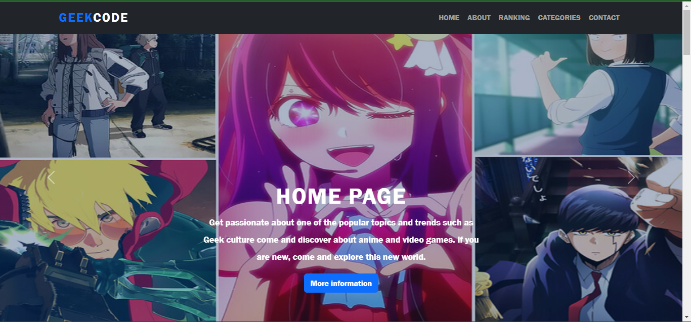
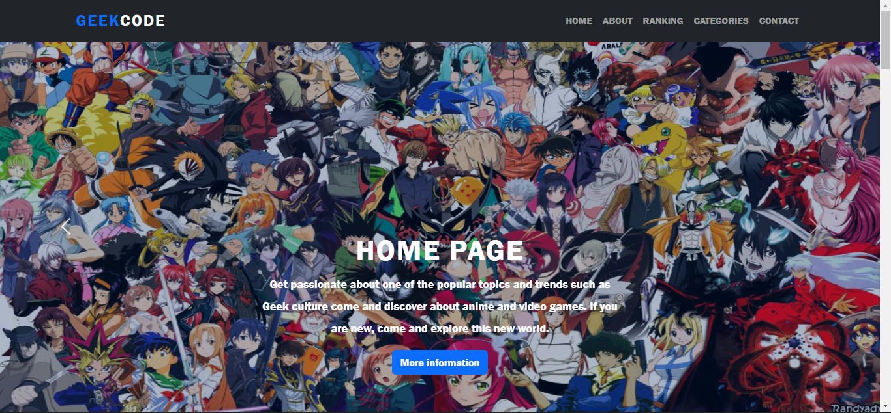
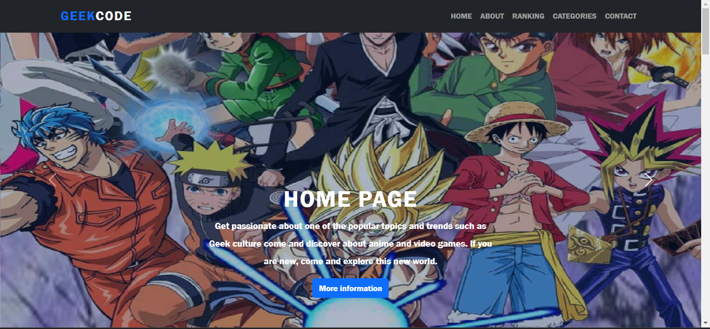
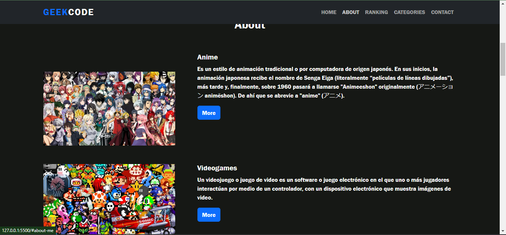
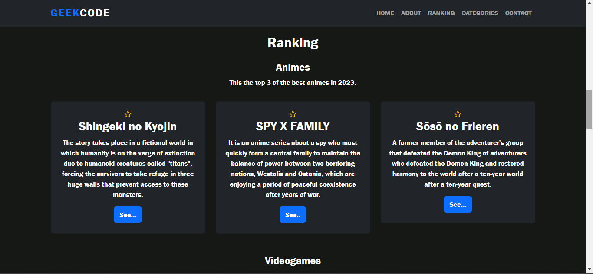
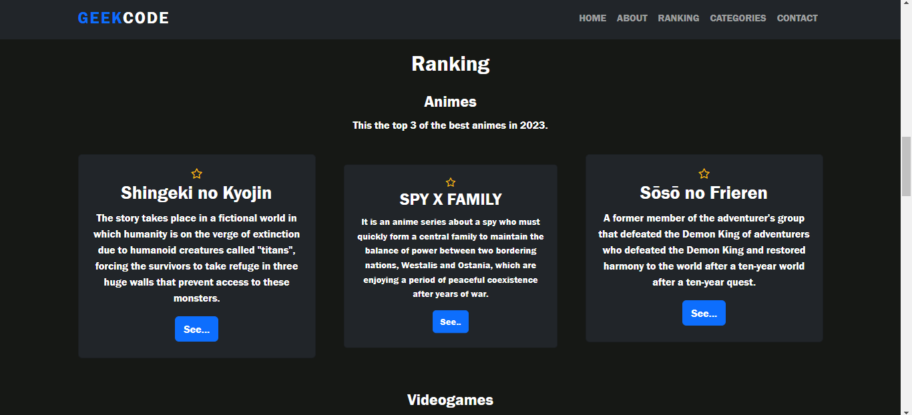
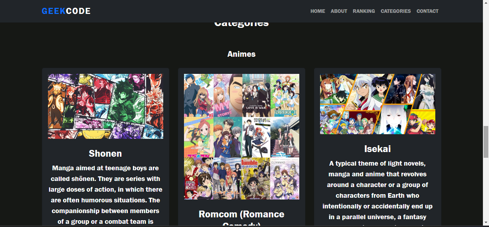
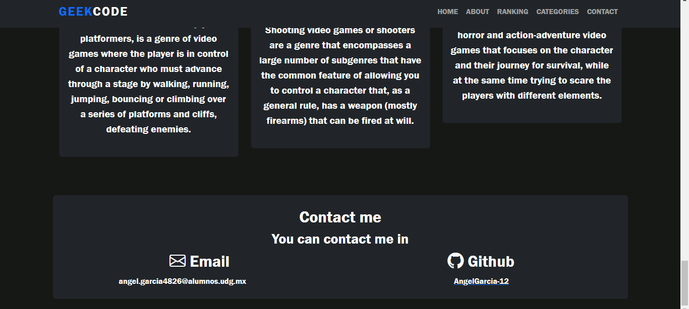
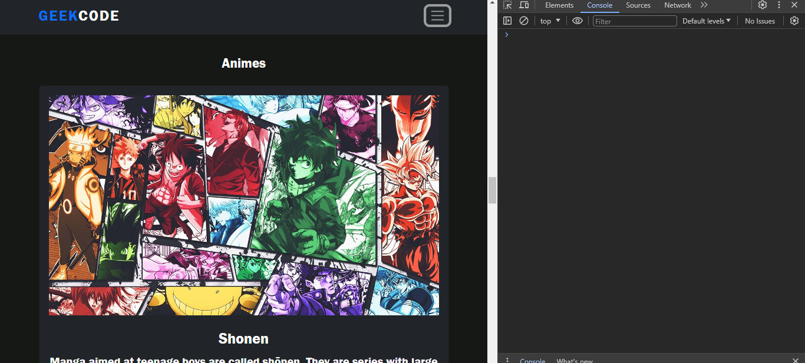

# Pagina Web con Bootstrap

Consiste en una pagina web sobre cultura geek.
En un inicio se nos muestra la pantalla de home, donde tenemos
un mensaje de bienvenida en la pagina y esta contiene un slide 
de imagenes que van cambiando.

De igual manera vemos en la parte superior derecha las pestañas de 
cada una de las secciones, en las cuales al hacer click nos manda a
dicha seccion.

Seccion About

Seccion Ranking.
En esta seccion podemos ver que cuando pasamos el mouse por
alguna de las tarjetas, estas hacen un efecto de zoom.

Seccion Categories.
En esta seccion es un poco parecida a la de ranking con la 
diferencia de que las tarjetas tienen una imagen de la categoria.

Seccion Contact.
Por ultimo, tenemos la seecion de contacto donde estan la manera
de contactarme solamente.

Tambien es responsive que era el objetivo que se buscaba utilizando
el framework de bootstrap. Cuando se reduce el tamaño de la ventana
podemos ver que las pestañas se reemplazan por un icono de barra
y las imagenes al igual que la informacion siguen siendo visibles.

